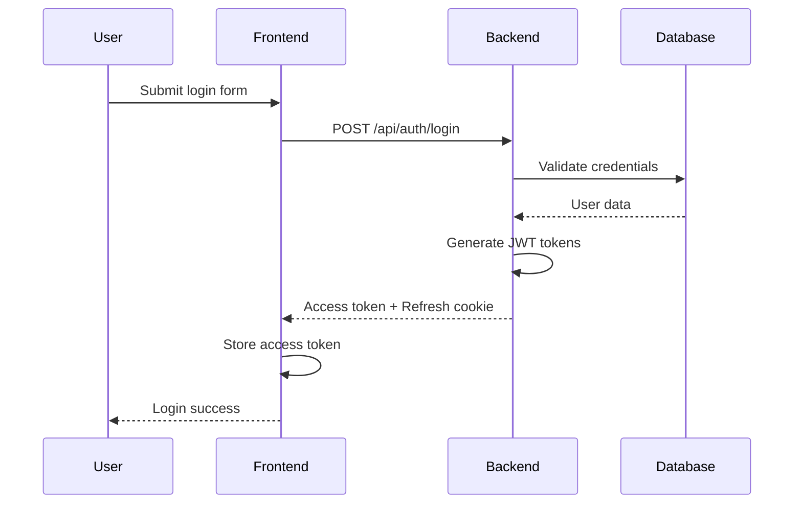
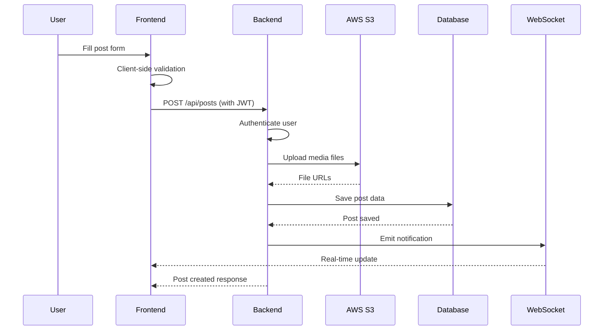
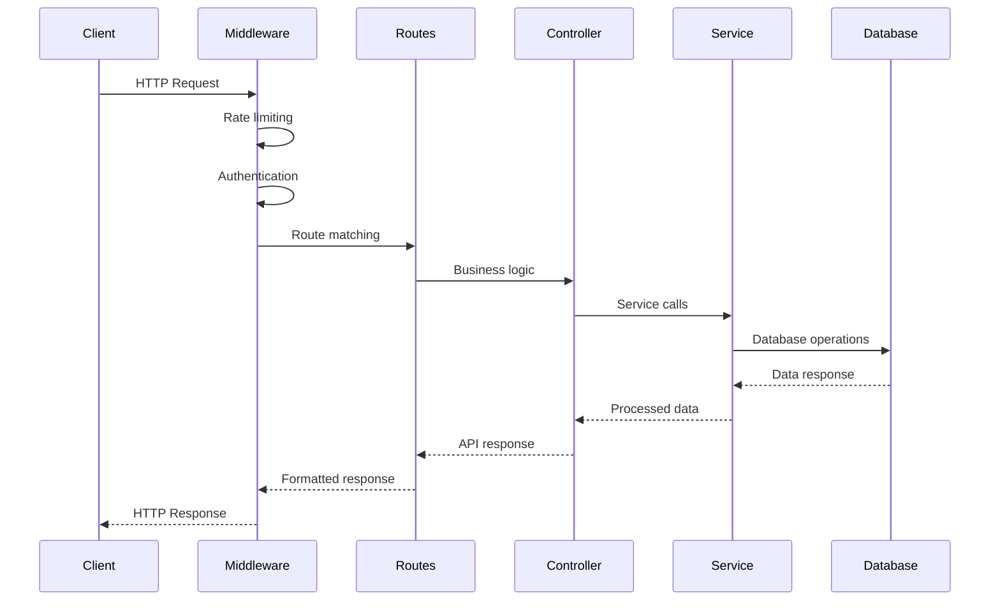

# System Architecture and Design Decisions

## Overview

College Media is a comprehensive social media platform designed for educational institutions, built with modern web technologies to provide a secure, scalable, and user-friendly experience for students, faculty, and staff.

### Core Components

- **Frontend**: React 19 application with modern UI components
- **Backend**: Node.js/Express API server with RESTful endpoints
- **Database**: MongoDB with Mongoose ODM
- **Authentication**: JWT-based authentication with refresh tokens
- **File Storage**: AWS S3 for media uploads
- **Real-time Features**: Socket.IO for live notifications and chat
- **Caching**: Redis for session management and rate limiting
- **Email Service**: Resend for transactional emails

## Component Architecture

### Frontend Architecture

```
src/
├── components/          # Reusable UI components
│   ├── common/         # Generic components (Button, Input, etc.)
│   ├── layout/         # Layout components (Navbar, Sidebar)
│   ├── posts/          # Post-related components
│   └── users/          # User profile components
├── pages/              # Route-level components
│   ├── Home.jsx
│   ├── Profile.jsx
│   ├── SearchResults.jsx
│   └── AdminDashboard.jsx
├── hooks/              # Custom React hooks
│   ├── useAuth.js
│   ├── usePosts.js
│   └── useNotifications.js
├── context/            # React context providers
│   ├── AuthContext.jsx
│   ├── NotificationContext.jsx
│   └── ThemeContext.jsx
├── services/           # API service layer
│   ├── api.js
│   ├── authService.js
│   └── postService.js
├── utils/              # Utility functions
│   ├── formatters.js
│   ├── validators.js
│   └── constants.js
└── styles/             # Global styles and Tailwind config
```

### Backend Architecture

```
backend/
├── routes/             # API route handlers
│   ├── auth.js
│   ├── posts.js
│   ├── users.js
│   └── admin.js
├── controllers/        # Business logic layer
│   ├── authController.js
│   ├── postController.js
│   └── userController.js
├── models/            # Database models
│   ├── User.js
│   ├── Post.js
│   ├── Comment.js
│   └── RefreshToken.js
├── middleware/        # Express middleware
│   ├── auth.js
│   ├── rateLimiter.js
│   ├── validation.js
│   └── errorHandler.js
├── services/          # Business services
│   ├── emailService.js
│   ├── notificationService.js
│   └── fileUploadService.js
├── utils/             # Utility functions
│   ├── tokenUtil.js
│   ├── logger.js
│   └── validators.js
├── config/            # Configuration files
│   ├── db.js
│   ├── aws.js
│   └── passport.js
└── tests/             # Test files
```

## Data Flow Diagrams

### User Authentication Flow



### Post Creation Flow



### API Request Flow



## Database Schema Documentation

### User Model
```javascript
{
  _id: ObjectId,
  username: String (required, unique),
  email: String (required, unique, lowercase),
  password: String (required, hashed),
  firstName: String,
  lastName: String,
  profilePicture: String,
  bio: String,
  role: Enum ['user', 'moderator', 'admin'] (default: 'user'),
  isActive: Boolean (default: true),
  isVerified: Boolean (default: false),
  lastLoginAt: Date,
  failedLoginAttempts: Number (default: 0),
  lockUntil: Date,
  resetPasswordToken: String,
  resetPasswordExpires: Date,
  followers: [ObjectId],
  following: [ObjectId],
  blockedUsers: [ObjectId],
  createdAt: Date,
  updatedAt: Date
}
```

### Post Model
```javascript
{
  _id: ObjectId,
  author: ObjectId (ref: 'User'),
  content: String (required),
  media: [{
    type: String (enum: ['image', 'video']),
    url: String,
    thumbnail: String
  }],
  likes: [ObjectId],
  comments: [ObjectId],
  tags: [String],
  visibility: String (enum: ['public', 'friends', 'private']),
  isDeleted: Boolean (default: false),
  createdAt: Date,
  updatedAt: Date
}
```

### RefreshToken Model
```javascript
{
  _id: ObjectId,
  userId: ObjectId (ref: 'User'),
  token: String (required, unique),
  expiresAt: Date,
  revoked: Boolean (default: false),
  createdAt: Date
}
```

## API Design Principles

### RESTful Design
- Resource-based URLs (`/api/users`, `/api/posts`)
- HTTP methods for CRUD operations
- Consistent response format
- Proper HTTP status codes

### Authentication
- JWT Bearer tokens for API access
- Refresh tokens in httpOnly cookies
- Token rotation on refresh
- Secure token storage

### Validation
- Input sanitization and validation
- Type checking and schema validation
- Error messages without sensitive data
- Rate limiting per endpoint

### Error Handling
- Consistent error response format
- Appropriate HTTP status codes
- Logging for debugging
- User-friendly error messages

## Security Architecture

### Authentication & Authorization
- **JWT Tokens**: HS256 algorithm with strong secrets
- **Token Expiration**: Access (15min), Refresh (7 days)
- **Password Security**: bcrypt with 12 salt rounds
- **Brute Force Protection**: Progressive delays, account lockout
- **Session Management**: Single active session per user

### API Security
- **Rate Limiting**: 100 requests/minute per IP
- **CORS**: Configured for allowed origins
- **Input Validation**: All inputs validated and sanitized
- **SQL Injection Protection**: Parameterized queries (MongoDB)
- **XSS Protection**: Input sanitization and CSP headers

### Data Protection
- **Encryption at Rest**:
  - Database: Sensitive fields encrypted with AES-256
  - Files: AWS S3 server-side encryption
  - Keys: Managed through AWS KMS
- **Encryption in Transit**:
  - HTTPS: All communications use TLS 1.3
  - Certificate: Valid SSL certificates required
  - HSTS: HTTP Strict Transport Security enabled

### Security Monitoring
- **Logging**:
  - Authentication Events: Login attempts, failures
  - API Access: Rate limit violations, suspicious patterns
  - Data Access: Sensitive data access logging
- **Alerts**:
  - Failed Login Attempts: Threshold-based alerts
  - Rate Limit Violations: Automatic blocking
  - Security Incidents: Immediate notification

## Scalability Considerations

### Horizontal Scaling
- **Stateless API**: No server-side sessions
- **Database Sharding**: MongoDB sharding for large datasets
- **Load Balancing**: Nginx for distributing traffic
- **CDN**: CloudFront for static assets

### Performance Optimization
- **Caching**: Redis for frequently accessed data
- **Database Indexing**: Optimized indexes for queries
- **File Compression**: Gzip compression for responses
- **Lazy Loading**: Components and images loaded on demand

### Monitoring & Metrics
- **Application Metrics**: Response times, error rates
- **System Metrics**: CPU, memory, disk usage
- **Database Metrics**: Query performance, connection pools
- **User Metrics**: Active users, engagement rates

## Technology Choices Rationale

### Frontend: React 19
- **Modern Framework**: Latest React with concurrent features
- **Component-Based**: Reusable and maintainable UI components
- **Ecosystem**: Rich ecosystem of libraries and tools
- **Performance**: Virtual DOM and efficient rendering

### Backend: Node.js/Express
- **JavaScript Full-Stack**: Consistent language across stack
- **Non-Blocking I/O**: Efficient handling of concurrent requests
- **NPM Ecosystem**: Extensive libraries for various needs
- **Microservices Ready**: Easy to scale and deploy

### Database: MongoDB
- **Document Model**: Flexible schema for social media data
- **Scalability**: Horizontal scaling with sharding
- **JSON-like**: Natural fit for JavaScript applications
- **Indexing**: Powerful indexing for complex queries

### Authentication: JWT
- **Stateless**: No server-side session storage
- **Scalable**: Works well with distributed systems
- **Secure**: Cryptographically signed tokens
- **Flexible**: Can include custom claims

### File Storage: AWS S3
- **Scalable**: Handles large amounts of media files
- **Reliable**: High availability and durability
- **Cost-Effective**: Pay-as-you-go pricing
- **Integrated**: Works well with other AWS services

### Real-time: Socket.IO
- **Cross-Platform**: Works on all modern browsers
- **Fallback**: Falls back to HTTP polling if needed
- **Scalable**: Supports clustering and load balancing
- **Feature-Rich**: Rooms, namespaces, and middleware support

### Caching: Redis
- **High Performance**: In-memory data structure store
- **Persistence**: Optional data persistence
- **Pub/Sub**: Built-in publish/subscribe messaging
- **Data Structures**: Rich data types for complex caching

## Deployment Architecture

### Development Environment
- Local development with hot reloading
- Docker containers for consistent environments
- Local MongoDB and Redis instances

### Production Environment
- Containerized deployment with Docker
- Orchestrated with Kubernetes
- Load balanced with AWS ALB
- Monitored with CloudWatch

### CI/CD Pipeline
- Automated testing on pull requests
- Code quality checks with ESLint
- Security scanning with dependency checks
- Automated deployment to staging/production

## Future Considerations

### Microservices Migration
- Break down monolithic backend into microservices
- Independent deployment and scaling
- Technology diversity per service

### Advanced Caching
- Implement CDN for global content delivery
- Edge computing for reduced latency
- Intelligent cache invalidation strategies

### AI/ML Integration
- Content moderation with machine learning
- Personalized recommendations
- Automated content tagging

### Advanced Security
- Multi-factor authentication (MFA)
- Zero-trust architecture
- Advanced threat detection

This documentation provides a comprehensive overview of the College Media system architecture and serves as a guide for developers, maintainers, and stakeholders to understand the system's design and make informed decisions about future development.